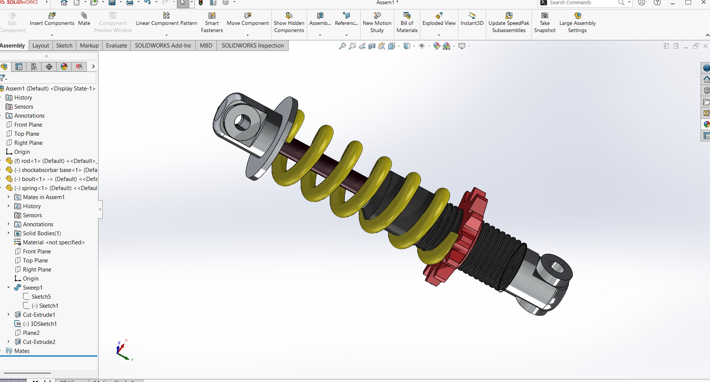
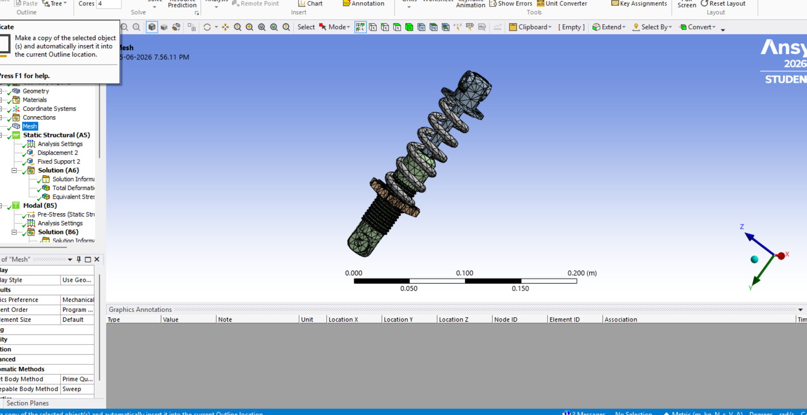
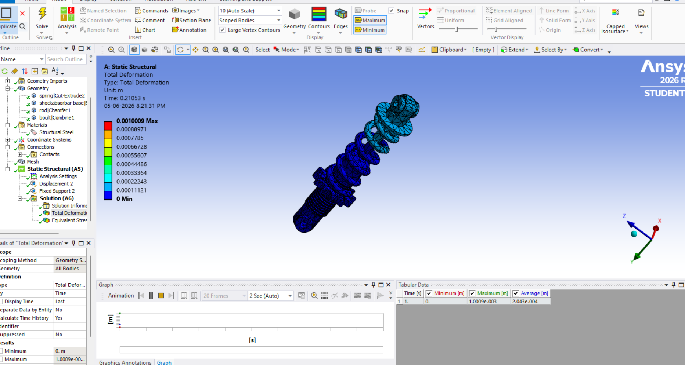

# Shock Absorber Design and FEA Analysis

## Author

**Vaishnav S**
Mechanical Engineering Student
RIT Kottayam

## Project Overview

This project focuses on the design and analysis of a shock absorber using SolidWorks and ANSYS Workbench. The objective was to evaluate the structural and vibration characteristics of the shock absorber through Finite Element Analysis (FEA).

## Software Used

* SolidWorks
* ANSYS Workbench

## Analyses Performed

### Static Structural Analysis

* Total Deformation Analysis

### Modal Analysis

* Natural Frequency Evaluation
* Six Mode Shapes Extracted

### Random Vibration Analysis

* PSD Excitation Input
* Directional Deformation
* Equivalent Stress Analysis

## Results

| Parameter               | Result    |
| ----------------------- | --------- |
| Maximum Deformation     | 1.0009 mm |
| Mode 1 Frequency        | 618.78 Hz |
| Mode 2 Frequency        | 625.92 Hz |
| Mode 3 Frequency        | 873.09 Hz |
| Mode 4 Frequency        | 900.35 Hz |
| Mode 5 Frequency        | 1139.3 Hz |
| Mode 6 Frequency        | 1226.7 Hz |
| Random Vibration Stress | 1987 Pa   |

## Learning Outcome

This project was completed as a self-learning exercise to understand CAD modelling, meshing, static structural analysis, modal analysis, and random vibration analysis using ANSYS Workbench.

## Repository Contents

* CAD Model
* Mesh Generation
* Static Structural Results
* Modal Analysis Results
* Random Vibration Results
* Project Report
## CAD Model

## Mesh

## Static Structural Analysis

